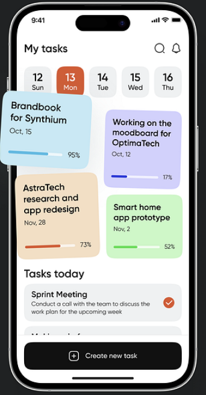

# Curso Flutter Diego
El primer proyecto que va a estar haciendo es la aplicación de la imagen

## Clase 1: Colores constantes y archivos de barril

Va a ver que dentro de la carpeta /lib hay 2 carpetas: core y presentation. Esta estructura de archivos es parte de
una arquitectura de código llamada *Clean Architecture*. Faltan muchas más partes pero para empezar es suficiente.

En *core* van esas cosas que de cierto modo "configuran" la aplicación y se usan en todas partes de ella, por ejemplo:
constantes, router (sirve para navegar entre screens, lo veremos despues), tema de la aplicación, etc.

En *presentation* (capa de presentación) va todo lo relacionado con el UI de la aplicación, o sea lo que el usuairo
ve. En este caso hay dos carpetas: /screens para las pantallas y /widgets para los widgets que vaya a usar repetidamente,
ya sea en una sola pantalla o en varias, la idea es que el código sea reutilizable y "atomizado", o sea que un widget no
dependa de un padre o "molecula" para existir. Eso también es un patrón de software que iremos viendo con ejemplos
a lo largo del curso.

Entonces, ahora sí, los temas de esta sección son: Colores constantes y archivos de barril.

### Colores constantes

En la carpeta /constants va a crear una archivo dart llamado app_colors.

En ese archivo va crear una clase llamada AppColors.

Esa clase debe tener varios atributos estáticos constantes, donde cada uno es un color de la aplicación de la imagen.

#### 💡Pista
debe usar el tipo `Color()` pasando como parametro **"0xFF{y aqui el codigo hex del color}"**.
Para saber cual es el código Hex del color, hay muchas herramientas que puede bucar, hay una llamada ColorZilla, IntelliJ tiene una integrada.

Haga eso para todos los colores de la imagen, el blanco no es necesario, y pongales nombres descriptivos, ejemplo:

- lightGreen
- darkOrange

### Archivos de barril
Va a ver que en todas las carpetas hay archivos con el nombre de la carpeta: constants, screens, widgets.

Estos archivos ud los va a volver "archivos de barril". Un archivo de barril sirve para que usted exporte todos los widgets, clases y funciones que hay en una determinada carpeta, para que a la hora de usted usarlos desde otro archivo, no le pase esto:

Porque usando un archivo de barril, queda así

Para exportar los archivos de una carpeta desde un archivo barril se usa la misma sintaxis del `import`, pero en vez de import, se usa `export`.

#### Tarea

- Exportar app_colors.dart desde el respectivo archivo de barril
- Crear un archivo app_router.dart sin contendo en /constants y exportarlo
- Crear un archivo home_screen con un stateless widget que retorne un `Placeholder` en /screens y exportarlo

Hola esto es un cambio